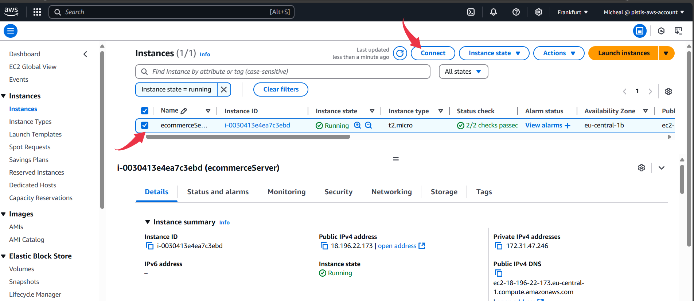
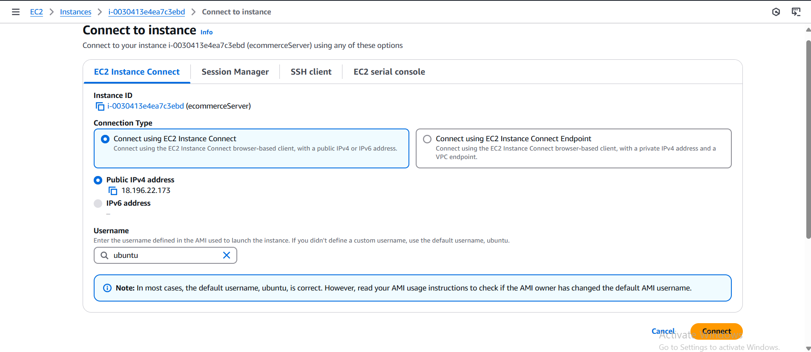
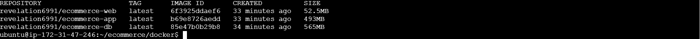
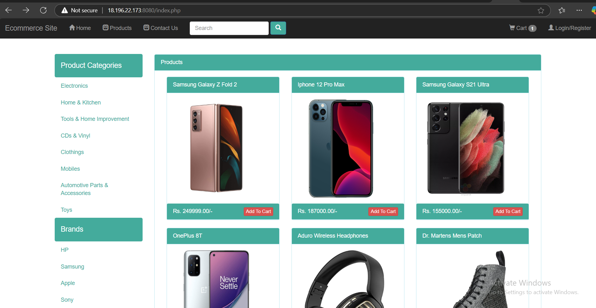
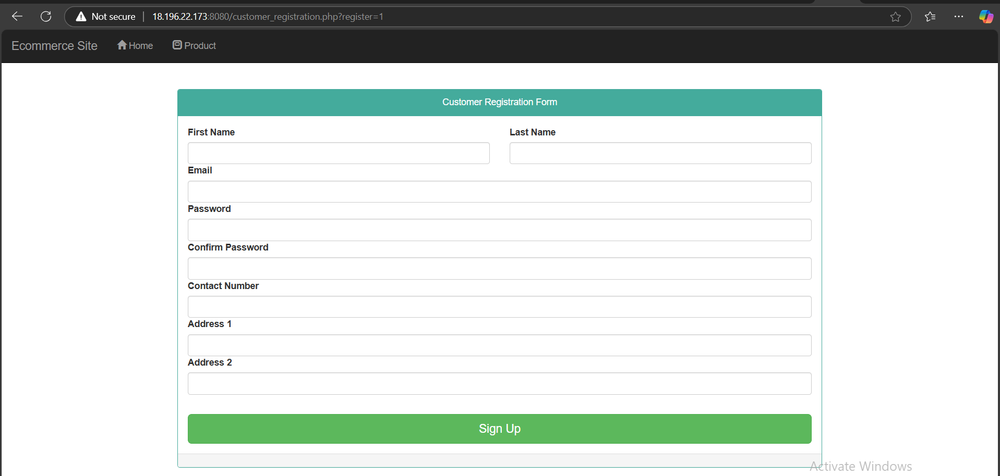
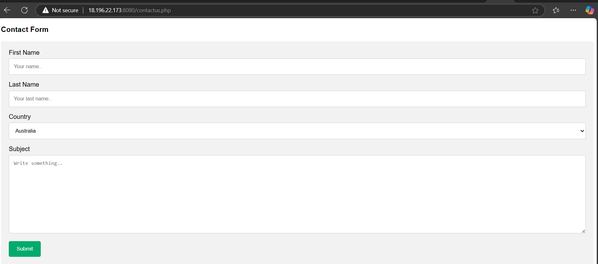

In this project we will be containerising an **e-commerce application** using Docker. Rather than deploying the whole app as a single service, we will isolate each core components of the application as a standalone service, using Docker's **multi-stage build** approach. This project ensures efficient build by reducing the size of final container images, thereby following best practices and making optimized app for production.

---

## Technologies
- MySQL
- PHP
- Nginx
- Docker
- RabbitMQ
- Memcached

## Prerequisites
- Docker Hub account
- AWS account

### **Multi-Service Architecture**

The application is composed of multiple Docker services, each with a specific role:

1. **Database Service (`ecommercedb`)**:
   - Uses **MySQL** to store and manage persistent data, including user details, product information, and orders.
   - The Dockerfile is configured with environment variables for credentials (`MYSQL_USER`, `MYSQL_PASSWORD`) and database name (`MYSQL_DATABASE`). Finally we added the database file `ecommerceapp.sql` to initialize the database.

```dockerfile
FROM mysql:8.0.33

# Add labels for metadata
LABEL "Project"="Ecommerce"
LABEL "Author"="Revelation69"

# Set environment variables for MySQL
ENV MYSQL_ROOT_PASSWORD="ecommerce_root_pass"
ENV MYSQL_DATABASE="ecommerce_db"
ENV MYSQL_USER="ecommerce_user"
ENV MYSQL_PASSWORD="ecommerce_user_pass"

# Add the database backup file to initialize the database
ADD ecommerceapp.sql /docker-entrypoint-initdb.d/ecommerceapp.sql
```
2. **PHP Application Service (`ecommerceapp`)**:
   - Runs the backend logic of the application using **PHP-FPM**.
   - Handles requests and interacts with the database to fetch or modify data.
   - The Dockerfile sets the WORKDIR within the container, installs required PHP extentions and set permissions. Finally, it exposes the container on port 9000.

```dockerfile
   FROM php:8.2-fpm

# Add labels for metadata
LABEL "Project"="Ecommerce"
LABEL "Author"="Revelation69"

# Set the working directory
WORKDIR /var/www/html

# Install required PHP extensions and set permissions
RUN docker-php-ext-install mysqli pdo pdo_mysql && \
    chown -R www-data:www-data /var/www/html && \
    chmod -R 755 /var/www/html

# Expose PHP-FPM port
EXPOSE 9000
```


3. **Web Server Service (`ecommerceweb`)**:
   - Serves as the frontend of the application using **Nginx**.
   - Handles static content (e.g., CSS, JS) and proxies dynamic requests to the PHP application.
   -The Dockerfile copies our custom `default.conf` into Nginx's default configuration directory. The container is then exposed on port 80

```dockerfile
FROM nginx:alpine

# Copy the Nginx configuration file
COPY default.conf /etc/nginx/conf.d/default.conf

# Expose the HTTP port
EXPOSE 80
```
4. **Cache Service (`ecommercecache01`)**:
   - Uses **Memcached** for caching data such as sessions or frequently accessed queries to improve performance.
   - Exposes port `11211` for application access.

5. **Message Queue Service (`ecommercemq01`)**:
   - Implements asynchronous communication between services using **RabbitMQ**.
   - Useful for tasks like sending notifications or handling order updates.
   - Configured with default credentials (`RABBITMQ_DEFAULT_USER` and `RABBITMQ_DEFAULT_PASS`) and exposes port `15672` for management.

---

Now, let's walk through our docker-compose file.

Let's break down each service in the `docker-compose.yml` file one by one:

### **1. `ecommercedb` (Database Service)**

```yaml
ecommercedb:
  build:
    context: ./db
  image: <your_dockerhub_username>/ecommerce-db
  container_name: ecommercedb
  ports:
    - "3306:3306"
  volumes:
    - ecommercedbdata:/var/lib/mysql
  environment:
    - MYSQL_ROOT_PASSWORD=ecommerce_root_pass
    - MYSQL_DATABASE=ecommerce_db
    - MYSQL_USER=ecommerce_user
    - MYSQL_PASSWORD=ecommerce_user_pass
```

- **`build.context: ./db`**: This specifies the directory (`./db`) where the Dockerfile for the database service (`ecommercedb`) is located. Docker will use this directory to build the image for the service.
  
- **`image: <your_dockerhub_username>/ecommerce-db`**: The image name is `<your_dockerhub_username>/ecommerce-db`, which will be the final name of the built image for the database container.
  
- **`container_name: ecommercedb`**: This assigns a custom name to the container. Instead of Docker assigning a random name, it will use `ecommercedb` as the container's name.
  
- **`ports: - "3306:3306"`**: The container’s internal port `3306` (MySQL’s default port) is mapped to the host machine's `3306` port, making the database accessible from the host machine.

- **`volumes: - ecommercedbdata:/var/lib/mysql`**: This mounts a Docker-managed volume (`ecommercedbdata`) to the `/var/lib/mysql` directory inside the container, where MySQL stores its data. This ensures that database data persists even when the container is stopped or removed.

- **`environment`**: These environment variables are used to configure the MySQL database:
  - `MYSQL_ROOT_PASSWORD`: Root user password for MySQL.
  - `MYSQL_DATABASE`: Name of the default database to be created.
  - `MYSQL_USER`: A non-root user for MySQL.
  - `MYSQL_PASSWORD`: Password for the non-root user.

---

### **2. `ecommerceapp` (PHP Backend Application Service)**

```yaml
ecommerceapp:
  build:
    context: ./app
  image: <your_dockerhub_username>/ecommerce-app
  container_name: ecommerceapp
  ports:
    - "9000:9000"
  volumes:
    - ./Ecommerce-app-h:/var/www/html
  depends_on:
    - ecommercedb
```

- **`build.context: ./app`**: This specifies the directory (`./app`) containing the Dockerfile to build the backend application service (`ecommerceapp`). The Dockerfile in this directory will be used to create the image for the backend service.
  
- **`image: <your_dockerhub_username>/ecommerce-app`**: The final name of the image for the backend PHP application is `<your_dockerhub_username>/ecommerce-app`.
  
- **`container_name: ecommerceapp`**: This sets the name of the container running the backend PHP application as `ecommerceapp`.

- **`ports: - "9000:9000"`**: Maps port `9000` inside the container to port `9000` on the host machine. This is typically the PHP-FPM port used for PHP processing. You can access the PHP application via this port.

- **`volumes: - ./Ecommerce-app-h:/var/www/html`**: This mounts the local `Ecommerce-app-h` directory (which contains the application source code) to the `/var/www/html` directory inside the container. This ensures that the application inside the container always has access to the latest code.

- **`depends_on: - ecommercedb`**: This indicates that `ecommerceapp` depends on `ecommercedb`. Docker Compose will ensure that the `ecommercedb` service is started before the `ecommerceapp` service. This makes sure that the application has access to the database when it starts.

---

### **3. `ecommerceweb` (Nginx Web Server Service)**

```yaml
ecommerceweb:
  build:
    context: ./web
  image: <your_dockerhub_username>/ecommerce-web
  container_name: ecommerceweb
  ports:
    - "8080:80"
  volumes:
    - ./Ecommerce-app-h:/var/www/html
  depends_on:
    - ecommerceapp
```

- **`build.context: ./web`**: This specifies the directory (`./web`) where the Dockerfile for the Nginx web service is located. Nginx will serve as a reverse proxy for the PHP backend application.

- **`image: <your_dockerhub_username>/ecommerce-web`**: The final name of the image for the Nginx web server is `<your_dockerhub_username>/ecommerce-web`.

- **`container_name: ecommerceweb`**: This sets the container name for the web service to `ecommerceweb`.

- **`ports: - "8080:80"`**: Maps port `80` (the default HTTP port) inside the container to port `8080` on the host machine. You can access the website through `http://<ip_address>:8080`.

- **`volumes: - ./Ecommerce-app-h:/var/www/html`**: This mounts the local `Ecommerce-app-h` directory (which contains the web application files) to `/var/www/html` inside the container. Nginx will serve the frontend files from here.

- **`depends_on: - ecommerceapp`**: This ensures that the `ecommerceweb` service (Nginx) will not start until the `ecommerceapp` service (PHP backend) is running. This ensures that the backend service is available when the web service starts.

---

### **4. `volumes` Section**

```yaml
volumes:
  ecommercedbdata: {}
```

- **`ecommercedbdata`**: This defines a named volume used to persist data from the `ecommercedb` (MySQL) container. The `ecommerceapp` and `ecommerceweb` services don’t directly use this volume, but it ensures that the database's data (such as users, products, and orders) persists even if the container is stopped or removed.


Done with theories, now let's get our hands dirty!

## Step 1: Launch an EC2 Instance

Setup an EC2 instance with the following parameters:
- OS: Ubuntu 24.04
- Instance type: t2.micro
- A key-pair (existing or new)
- Security Group (Inbound rule): Allow SSH traffic from `My IP`, Allow HTTP and HTTPS traffic from the internet.

Leave the other fields as default the launch your instance.

*Note: Remeber to give your instance a name.*



## Step 2: Connect to your Instance

Click on your instance and navigate to `Connect`, then connect to your instance using the **EC2 Instance Connect** option. AFterwards run the following commands on the Instance command line.



### Install Docker Engine

```bash
sudo apt update
sudo apt install -y ca-certificates curl gnupg

# Create directory for Docker's keyring
sudo install -m 0755 -d /etc/apt/keyrings

# Add Docker's GPG key
curl -fsSL https://download.docker.com/linux/ubuntu/gpg | sudo gpg --dearmor -o /etc/apt/keyrings/docker.gpg
sudo chmod a+r /etc/apt/keyrings/docker.gpg

# Add Docker repository
echo "deb [arch=$(dpkg --print-architecture) signed-by=/etc/apt/keyrings/docker.gpg] https://download.docker.com/linux/ubuntu $(lsb_release -cs) stable" | sudo tee /etc/apt/sources.list.d/docker.list > /dev/null

# Update package index and install Docker
sudo apt update
sudo apt install -y docker-ce docker-ce-cli containerd.io docker-buildx-plugin docker-compose-plugin

```

### Add ubuntu into the docker group 
```bash
sudo usermod aG docker ubuntu
```

## Setup Docker Hub

- Get the source code, fork the github repo to your own repository, then clone it to our local system and to the Instance Connect CLI

```bash
git clone https://github.com/Revelation69/ecommerce.git
```
- Open the project folder on the CLI and switch to the branch `containers` by running:
```bash
git checkout containers
```

Every other thing is setup for you, all you need is to login to Docker Hub, build the Dockerfiles using the docker-compose file at the root of the project, then push the built images to Docker Hub, and finally run start the container. Let's do all these:

It seems that the issue is that your Docker images were built locally but never pushed to Docker Hub. To push the images to Docker Hub, follow these steps:

### 1. **Login to Docker Hub**:
First, ensure that you are logged in to Docker Hub from the command line:

```bash
docker login
```

Enter your Docker Hub credentials when prompted. This ensures you have permission to push images to your Docker Hub account.

### 2. **Build the Images**:
Make sure you've built the images locally using Docker Compose. Run the following command in the project directory where your `docker-compose.yml` file is located:

```bash
docker-compose build
```

This will build all the images specified in the `docker-compose.yml` file, including the `ecommercedb`, `ecommerceapp`, and `ecommerceweb` images.

### 3. **Tag the Images**:
Ensure that the images are tagged with your Docker Hub username (if they aren't already). For example, you can tag the images manually after building:

```bash
docker tag <your_dockerhub_username>/ecommerce-db <your_dockerhub_username>/ecommerce-db:latest
docker tag <your_dockerhub_username>/ecommerce-app <your_dockerhub_username>/ecommerce-app:latest
docker tag <your_dockerhub_username>/ecommerce-web <your_dockerhub_username>/ecommerce-web:latest
```

This is important because Docker Hub uses tags to manage versions of images.

### 4. **Push the Images to Docker Hub**:
Now, push the images to Docker Hub. Use the following command to push each image:

```bash
docker push <your_dockerhub_username>/ecommerce-db:latest
docker push <your_dockerhub_username>/ecommerce-app:latest
docker push <your_dockerhub_username>/ecommerce-web:latest
```

This will upload the images to Docker Hub with the `latest` tag.

### 5. **Verify the Images**:
Once the images are pushed, go to your Docker Hub account and verify that the images have been uploaded successfully. You should see them listed under your repositories.

```bash
docker compose images
```




### 6. **Launch the container**:
To run the application through containers, run

```bash
docker compose up -d
```

To check the running conatainers, run
```bash
docker ps
```

Finally, copy the public IP of the EC2 instance and run it on the browser (<ec2_ip>:8080)


---

---



**Clean up**
Shut down the containers
```bash
docker compose down
```

Last thing, delete all the images from the EC2 instance and shut it down. 